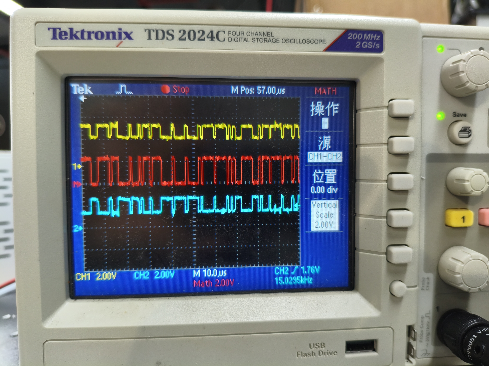
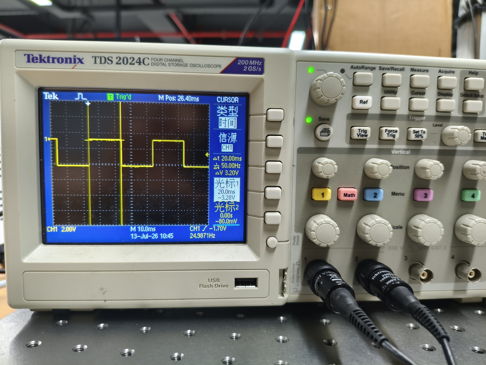

# Debug Records
  


## 一、波特率导致的双轮启停打滑问题
### 1、115200bps

  
### 2、57600bps
 
### 3、19200bps 
  
> 可见，当波特率提升，i.e.帧发送频率提升，双轮抢占总线的间隔缩短，达到拟同时驱动的效果，缓解了运行的非同时性  

## 二、离线状态下 m1_cycle_ms / m2_cycle_ms ≈ 3664ms 跳变分析

### 现象

两台电机均离线（断线/断电/站号错）时，VOFA CH16/CH17 显示的 `m1_cycle_ms` 和 `m2_cycle_ms` 在 **~3664ms** 附近跳变。

### 根源：两电机在单条 RS485 总线上互相交错超时

调度器按"单次 Modbus 事务"粒度轮询：M1 READ → M2 READ → M1 WRITE → M2 WRITE。
每台离线电机的单次事务走完 BSP 3 次物理重试才报 TIMEOUT，然后 FSM 层再用 3 次逻辑重试（每次逻辑重试发 `ERROR_RELEASED` 触发 advance，给另一电机插入机会），两电机完全交错。

### 逐层超时参数

| 层级 | 宏 | 值 | 说明 |
|------|-----|-----|------|
| 事务超时 | `APP_LD2_MOTOR_TIMEOUT_MS` | 100ms | `>` 判断，实测触发在 101~105ms |
| BSP 物理重试 | `BSP_RS485_MAX_RETRY` | 3 | 每事务最多 3 次物理重发 |
| FSM 逻辑重试 | `APP_LD2RS_TASK_MAX_RETRY` | 3 | 读/写各最多 3 次逻辑重试 |

### 完整交错时序

```
Slot  电机  事务         BSP重试×3     ≈耗时      后动作
─────────────────────────────────────────────────────
 1    M1    READ  att1  3×~102ms     ≈306ms     advance
 2    M2    READ  att1  3×~102ms     ≈306ms     advance
 3    M1    READ  att2  3×~102ms     ≈306ms     advance
 4    M2    READ  att2  3×~102ms     ≈306ms     advance
 5    M1    READ  att3  3×~102ms     ≈306ms     耗尽→强制零速, advance
 6    M2    READ  att3  3×~102ms     ≈306ms     耗尽→强制零速, advance
 7    M1    WRITE att1  3×~102ms     ≈306ms     advance
 8    M2    WRITE att1  3×~102ms     ≈306ms     advance
 9    M1    WRITE att2  3×~102ms     ≈306ms     advance
10    M2    WRITE att2  3×~102ms     ≈306ms     advance
11    M1    WRITE att3  3×~102ms     ≈306ms     耗尽, advance
12    M2    WRITE att3  3×~102ms     ≈306ms     耗尽, advance
13    M1    WRITE_DONE                          cycle_elapsed_ms 计算

≈ 12 × 306ms = 3672ms (+主循环 RC/VOFA/LED 开销 → ~3664ms)
```

### 为什么用 `>` 而非 `>=` 导致跳变

```c
// bsp_rs485.c — 超时判断
if ((now_tick - bus->start_tick_ms) > bus->timeout_ms)  // 严格大于 100ms
```

`>` 配合主循环轮询粒度不固定（RC 处理、VOFA 发送等），每次超时的实际延迟在 **101~105ms** 之间波动。12 次事务累积后，cycle_ms 在 **3640~3680ms** 之间跳变。

### 关键代码路径

- 超时判断：[bsp_rs485.c:172-178](BSP/Src/bsp_rs485.c#L172-L178)
- FSM 逻辑重试触发切换：[app_ld2rs_task.c:391-404](App/Src/app_ld2rs_task.c#L391-L404)
- cycle_ms 计算：[app_ld2rs_task.c:521-526](App/Src/app_ld2rs_task.c#L521-L526)

### 结论

3664ms 不是 Bug，是两台离线电机在一条 RS485 总线上按"单次事务轮询"调度器互相交错超时的正常耗时。若未来电机数 N 增加，离线 cycle_ms ≈ N × 12 × 102ms。

---

## 三、CMSIS-DSP 本地化记录

### 现象

原先 Keil RTE 勾选 `CMSIS -> DSP` 后，DSP 头文件和源码可能来自本机 Keil Pack 路径。工程移交给其他电脑时，如果对方没有相同 Pack 或路径不同，容易出现头文件或源码找不到的问题。

### 当前处理

- 将 CMSIS-DSP 放入工程根目录 `DSP/`。
- Keil 工程引用 `..\DSP\Include`、`..\DSP\PrivateInclude` 和 `../DSP/Source/...`。
- Makefile 引用 `DSP/Include`、`DSP/PrivateInclude`，并编译 `DSP/Source` 下非 F16 聚合源文件。
- Makefile 定义 `DISABLEFLOAT16`，当前 Cortex-M7/float32 使用场景不依赖 F16 路径。
- Keil RTE 的 `CMSIS:DSP Source` 不应再重复启用。

### 验证结论

无 `.lib` 也能链接成功是正常的：`arm_math.h` 负责声明，函数实现由 `DSP/Source` 下的 `.c` 编译后提供。`arm_sin_f32()` 依赖 `FastMathFunctions.c` 中的实现和 `CommonTables.c` 中的查表数据。

---

## 四、四舵轮 CAN ID 循环错位导致自转指向径向

### 现象

四舵轮底盘**平移正常**，但**自转（原地旋转）时四个轮毂指向径向（交叉十字），而非切线方向**。VOFA+ 上反馈的目标角/实际角与预期切线角偏差约 90°。

### 尝试过的方向（均无效）

1. **atan2 取反**：`atan2f(vy, vx)` → `-atan2f(vy, vx)` → 旋转对了但平移反了
2. **运动学公式变号**：`vy + wz*x` → `vy - wz*x` → 同样顾此失彼
3. **CMSIS-DSP arm_atan2_f32 替换**：与标准库 `atan2f` 无本质区别
4. **零偏重新标定**：反复重测仍无法同时满足平移和旋转

### 根因

**CAN ID 循环错位**：四个电机出厂 CAN ID 整体偏移 +1（FR 绕回 1）。

| 模块 | 实际 CAN ID | 代码宏 | 后果 |
|------|-----------|--------|------|
| FL | **2** | FL=1 | FL 收到 RL 的 atan2 目标角 |
| RL | **3** | RL=2 | RL 收到 RR 的 atan2 目标角 |
| RR | **4** | RR=3 | RR 收到 FR 的 atan2 目标角 |
| FR | **1** | FR=4 | FR 收到 FL 的 atan2 目标角 |

平移时四个轮指向同一方向，错位效应不明显。但自转时四个轮 atan2 角度各差约 90°，错位后呈现的正是交叉十字。

### 关键发现

正确的 CAN ID 排列 `FL=1, RL=2, RR=3, FR=4` 与模块枚举顺序 `FL=0, RL=1, RR=2, FR=3` 在逆时针方向上是**对应匹配**的。实际 ID 整体偏移 +1 打破了这种匹配关系，导致每个电机收到的位置指令都来自逆时针方向相邻的模块。

### 修复方法

在 `main.c` 借助临时 ID=5 破环，分 5 步依次修正：

```
① FR: 1→5  (临时避让)    ② FL: 2→1
③ RL: 3→2                 ④ RR: 4→3
⑤ FR: 5→4  (从临时 ID 归位)
```

每一步的 `old_id` 在总线上唯一，无寻址冲突。改完后 `bsp_can_robostride_set_motor_id_once()` 内部发送 0x16 保存到 Flash，断电不丢失。

对应的代码位置：[Core/Src/main.c:149-171](Core/Src/main.c#L149-L171)。

### 结论

四舵轮运动学公式本身**完全正确**：

```c
vx_i = vx - wz * y_i
vy_i = vy + wz * x_i
angle = atan2f(vy_i, vx_i)
```

不需要取反、换号或任何变体。前期所有运动学调试的挫折都是 CAN ID 错位导致的假象。

---

## 五、四舵轮 ID=4 电机"慢+卡"——AutoRetransmission=DISABLE 导致仲裁丢帧

### 现象

4 个 ROBSTRIDE RS00 舵向电机全挂载时，FR（CAN ID=4）响应明显慢于 FL/RL/RR，运动卡顿、不同步。单独接 ID=4 电机时正常。接 CAN 1+2+4（仅 3 台跳过 ID=3），ID=4 依然慢。

### 排查链路

| 步骤 | 排查项 | 结论 |
|------|--------|------|
| 1 | `ExtFiltersNbr=0` 但配置扩展过滤器 | **Bug**：消息 RAM 越界覆盖 RX FIFO 0 首元素。IOC 改为 `ExtFiltersNbr=1, StdFiltersNbr=0` |
| 2 | CAN ID 未重映射 | 已排除，上位机确认 4 台 ID 正确 |
| 3 | enable_report data[7] 字段 | 已排除，说明书确认 `0x00` 正确 |
| 4 | 缺少 EPScan_time 配置 | 新增 0x7026=3 (20ms) |
| 5 | 缺少 zero_sta 配置 | 新增 0x7029=1 (-π~π) |
| 6 | 参数掉电丢失 | 追加 type 22 (0x16) 保存全部参数到 Flash |
| 7 | PID 参数不一致 | 已排除，上位机验证 4 台参数完全一致 |
| 8 | FDCAN 软件配置 | 已排除，两个子代理独立审计无 ID 特异 Bug |

### 根因：CAN 仲裁优先级 + AutoRetransmission=DISABLE

**CAN 仲裁优先级（bit 28→0，0=显性胜）：**

```
Motor 反馈帧 (comm 0x02, bit28=0) > Host 位置指令 (comm 0x12, bit28=1)
```

MCU 发 position_ref 时若任何电机同时在发反馈，**仲裁 bit 28 就分出胜负，Host 永远输**。

CubeMX 默认 `AutoRetransmission = DISABLE`，对应 FDCAN 寄存器 `CCCR.DAR = 1`，仲裁失败后**硬件不重试，帧直接丢弃**：

```c
// stm32h7xx_hal_fdcan.c:454-462
if (hfdcan->Init.AutoRetransmission == ENABLE)
    CLEAR_BIT(hfdcan->Instance->CCCR, FDCAN_CCCR_DAR);  // DAR=0 → 重传开启
else
    SET_BIT(hfdcan->Instance->CCCR, FDCAN_CCCR_DAR);    // DAR=1 → 重传关闭 ← DISABLE
```

### 为什么 ID=4 受害最重

1. **启动顺序最后**：MCU 按 FL(1)→RL(2)→RR(3)→FR(4) 依次配置，轮到 FR 时前 3 台已在发反馈争抢总线
2. **运行时发送循环最后**：`bsp_can_robostride_send_steer_chassis_position` 循环 FL→RL→RR→FR，FR 的最后发送窗口最可能被新到达的反馈打断

### 为什么单独接 ID=4 正常

单电机时无其他反馈竞争总线，所有 Host 帧畅通无阻。

### 修复

| 文件 | 修改 |
|------|------|
| `CtrBoard-H7-AIBOT-DPD.ioc:25` | `FDCAN1.AutoRetransmission=ENABLE` |
| `Core/Src/fdcan.c:43` | `hfdcan1.Init.AutoRetransmission = ENABLE` |

改为 `ENABLE` 后 `CCCR.DAR = 0`，FDCAN 硬件自动重试仲裁失败/NACK 的帧直到成功发出，不阻塞 TX FIFO 后续帧。

### 涉及的关键文件

- FDCAN 初始化：[Core/Src/fdcan.c:40-67](Core/Src/fdcan.c#L40-L67)
- BSP 启动流程：[BSP/Src/bsp_can_robostride.c:222-314](BSP/Src/bsp_can_robostride.c#L222-L314)
- BSP 运行期发送：[BSP/Src/bsp_can_robostride.c:390-415](BSP/Src/bsp_can_robostride.c#L390-L415)
- 协议参数定义：[Middleware/RobStride/Inc/robstride_motor.h:84-96](Middleware/RobStride/Inc/robstride_motor.h#L84-L96)
- HAL DAR 寄存器逻辑：[Drivers/STM32H7xx_HAL_Driver/Src/stm32h7xx_hal_fdcan.c:454-462](Drivers/STM32H7xx_HAL_Driver/Src/stm32h7xx_hal_fdcan.c#L454-L462)

### 结论

`AutoRetransmission=DISABLE` 在单电机或低总线负载时无害。但当多电机同时在线时，Host 命令在 CAN 仲裁中优先级低于电机反馈帧，仲裁失败后帧被静默丢弃。ID 最大的电机（CAN ID=4）在启动和运行时都排在发送循环末尾，丢帧概率最高，表现为"慢+卡"。改为 `ENABLE` 后 4 电机基本同步。

---

# FDCAN AutoRetransmission 调试记录

## 1. 调试背景

当前工程基于 STM32H723VGT6，使用 HAL FDCAN 驱动中的 FDCAN1 外设控制 4 个 Robstride/RS00 舵向电机。通信形式为 Classic CAN + Extended ID，电机反馈帧和主控控制帧均使用 8 bytes 数据字段。

CubeMX 当前关键资源配置如下：

- RX FIFO0 depth = 16。
- TX FIFO Queue depth = 8。
- `RxFifo0ElmtSize = FDCAN_DATA_BYTES_8`。
- `TxElmtSize = FDCAN_DATA_BYTES_8`。

运行负载方面，Robstride 电机反馈周期约为 20 ms；控制侧按约 1 ms 间隔轮询发送一轮 4 帧控制命令。调试目标是分析 `AutoRetransmission` 开启/关闭对舵机控制连续性的影响，并结合 RX FIFO、TX FIFO、Error Counter 等计数器判断是否存在接收丢帧、FIFO 满、发送入队失败或 CAN 协议层错误。  
> FDCAN 自动重传会使仲裁失败的 TX 报文在总线空闲后由硬件自动重试发送,即自动重传是补录行为！
## 2. 问题现象

在关闭 `AutoRetransmission` 时，舵机控制效果较差，可能表现为动作不连续、响应不稳定，或某些控制周期的控制帧疑似未被电机执行。

在开启 `AutoRetransmission` 后，舵机控制效果明显改善，四个舵向电机的控制连续性和同步性更好。

同时，当前调试计数器中 RX FIFO0、TX FIFO 入队和 FDCAN Error Counter 均未显示明显异常。因此，本记录重点说明：计数器均为 0 与开启自动重传后控制效果改善并不矛盾。

## 3. 当前 FDCAN 配置

当前工程中 FDCAN1 关键配置如下：

```c
hfdcan1.Init.FrameFormat = FDCAN_FRAME_CLASSIC;
hfdcan1.Init.Mode = FDCAN_MODE_NORMAL;
hfdcan1.Init.AutoRetransmission = ENABLE;   /* 与 DISABLE 做过对比 */
hfdcan1.Init.ExtFiltersNbr = 1;
hfdcan1.Init.RxFifo0ElmtsNbr = 16;
hfdcan1.Init.RxFifo0ElmtSize = FDCAN_DATA_BYTES_8;
hfdcan1.Init.TxFifoQueueElmtsNbr = 8;
hfdcan1.Init.TxFifoQueueMode = FDCAN_TX_FIFO_OPERATION;
hfdcan1.Init.TxElmtSize = FDCAN_DATA_BYTES_8;
```

其中 `AutoRetransmission = ENABLE` 表示 FDCAN 硬件允许在发送失败、未完成或需要重试的情况下继续尝试发送。该机制作用于 TX 方向，不改变 RX FIFO0 的接收行为，也不会直接改变 RX FIFO0 的 full/lost 统计。

## 4. RX FIFO0 诊断结果

当前 RX FIFO0 诊断计数器如下：

| 变量 | 含义 |
|------|------|
| `g_fdcan1_rx_fifo0_msg_lost_count` | RX FIFO0 满后新帧丢失次数 |
| `g_fdcan1_rx_fifo0_full_count` | RX FIFO0 被填满次数 |
| `g_fdcan1_rx_fifo0_drain_limit_count` | 单次中断读取达到 16 帧上限后 FIFO0 仍未清空的次数 |

当前观察结果：

- `g_fdcan1_rx_fifo0_msg_lost_count = 0`。
- `g_fdcan1_rx_fifo0_full_count = 0`。
- `g_fdcan1_rx_fifo0_drain_limit_count = 0`。

基于当前观察，可以得出以下结论：

- RX FIFO0 未观察到明显堆积、满或丢帧。
- RX FIFO0 中断内使用 `while` drain FIFO0 的策略可以在 16 次以内清空 FIFO。
- 当前接收侧压力正常。

需要注意，RX FIFO0 计数器只反映 STM32 接收电机反馈时的 FIFO 状态，不反映主控控制帧是否在 TX 方向完成物理发送。

## 5. TX FIFO 诊断结果

当前 TX FIFO 发送侧诊断计数器如下：

| 变量 | 含义 |
|------|------|
| `g_fdcan1_tx_request_count` | 应用层尝试发送控制帧次数 |
| `g_fdcan1_tx_enqueue_ok_count` | 成功加入 TX FIFO 的次数 |
| `g_fdcan1_tx_fifo_full_count` | 发送前发现 TX FIFO 满的次数 |
| `g_fdcan1_tx_add_fail_count` | `HAL_FDCAN_AddMessageToTxFifoQ()` 返回失败次数 |
| `g_fdcan1_tx_last_hal_error` | 最近一次 HAL FDCAN 错误码 |

当前观察结果：

- `g_fdcan1_tx_request_count` 持续增加。
- `g_fdcan1_tx_enqueue_ok_count` 基本与 `g_fdcan1_tx_request_count` 同步增加。
- `g_fdcan1_tx_fifo_full_count = 0`。
- `g_fdcan1_tx_add_fail_count = 0`。
- `g_fdcan1_tx_last_hal_error = 0`。

基于当前观察，可以得出以下结论：

- 应用层发送函数能够正常把控制帧加入 TX FIFO。
- TX FIFO 未观察到满。
- `HAL_FDCAN_AddMessageToTxFifoQ()` 未观察到失败。

但必须明确区分三个层级：

- TX FIFO 入队成功：报文成功进入 FDCAN 控制器的发送 FIFO。
- CAN 总线物理发送成功：报文已经完成仲裁并在总线上发送完成。
- 电机业务层执行成功：Robstride 电机接收、解析并执行了该控制命令。

当前 TX 计数器只能证明第一层，即 TX FIFO 入队成功；它不能证明物理总线发送完成，也不能证明电机一定执行。

## 6. Error Counter 诊断结果

当前 Error Counter 诊断计数器如下：

| 变量 | 含义 |
|------|------|
| `g_fdcan1_error_counter_poll_count` | 错误计数器轮询函数调用次数 |
| `g_fdcan1_last_tx_error_counter` | 最近一次读取到的 `TxErrorCnt` |
| `g_fdcan1_last_rx_error_counter` | 最近一次读取到的 `RxErrorCnt` |
| `g_fdcan1_tx_error_counter_rise_count` | `TxErrorCnt` 上升次数 |
| `g_fdcan1_error_counter_read_fail_count` | `HAL_FDCAN_GetErrorCounters()` 读取失败次数 |

当前观察结果：

- `g_fdcan1_error_counter_poll_count` 持续增加，说明轮询函数确实被调用。
- `g_fdcan1_last_tx_error_counter = 0`。
- `g_fdcan1_last_rx_error_counter = 0`。
- `g_fdcan1_tx_error_counter_rise_count = 0`。
- `g_fdcan1_error_counter_read_fail_count = 0`。

基于当前观察，可以得出以下结论：

- 当前未观察到明显 CAN 协议层错误。
- 未观察到 ACK、Bit、CRC、Form 等导致 `TxErrorCnt` 或 `RxErrorCnt` 上升的错误。
- `HAL_FDCAN_GetErrorCounters()` 读取正常。

需要注意，Error Counter 反映的是 CAN 协议层错误压力，不反映 CAN 仲裁失败本身，也不等价于业务层控制帧是否被电机执行。

## 7. 为什么计数器为 0 但自动重传仍然有效

当前观察中，RX FIFO0 计数器为 0、TX FIFO 入队失败计数为 0、Error Counter 为 0，但开启 `AutoRetransmission` 后控制效果仍然改善。该现象并不矛盾。

原因如下：

1. `AutoRetransmission` 作用于 TX 方向，不作用于 RX FIFO。

   RX FIFO0 的 `full/lost/drain_limit` 计数器只说明接收侧未观察到 FIFO 满或丢反馈帧，不能说明主控发出的控制帧是否在总线上完成发送。

2. TX FIFO 入队成功不等于 CAN 总线物理发送成功。

   `HAL_FDCAN_AddMessageToTxFifoQ()` 返回成功，只表示报文已经进入 FDCAN TX FIFO。后续仍需要等待 FDCAN 控制器完成仲裁、发送、ACK 等总线过程。

3. CAN 仲裁失败不一定计入 `TxErrorCnt`。

   仲裁失败是 CAN 协议允许的正常总线竞争机制，不属于 ACK、Bit、CRC、Form 等协议错误。因此，即使某个控制帧在一次竞争中没有立即发出，Error Counter 也可能保持为 0。

4. 关闭 `AutoRetransmission` 时，低优先级控制帧更容易出现发送连续性下降。

   Robstride 电机反馈帧与主控控制帧都在同一 CAN 总线上竞争。若某些主控控制帧第一次发送未完成、未及时完成或在总线竞争中没有成功发出，关闭自动重传时硬件不会继续自动尝试，电机可能漏掉该周期控制命令。

5. 开启 `AutoRetransmission` 后，FDCAN 硬件会继续自动尝试发送。

   这可以提高控制帧最终发出的概率和发送连续性，从而改善舵机控制效果。

6. 当前无法精确统计硬件自动重传次数。

   现有计数器没有记录每一帧实际经历了多少次硬件自动重传。若后续需要精确观察发送完成事件，需要进一步启用 TX complete 相关监控；如需记录每帧事件，还可能需要规划 TX Event FIFO 和 Message Marker。

因此，当前现象的合理解释是：系统没有观察到明显 RX FIFO 丢帧、TX FIFO 入队失败或 CAN 协议层错误，但自动重传改善了 TX 控制帧在总线竞争或临时发送失败情况下的连续性。

## 8. 当前结论

基于当前观察，得到以下阶段性结论：

- 当前没有观察到 RX FIFO0 满、RX FIFO0 message lost 或 RX FIFO0 drain 不完的问题。
- 当前没有观察到 TX FIFO 满或 `HAL_FDCAN_AddMessageToTxFifoQ()` 入队失败。
- 当前没有观察到 `TxErrorCnt/RxErrorCnt` 上升，说明未发现明显 CAN 协议层错误。
- 当前计数器无法精确统计硬件自动重传次数。
- `AutoRetransmission = ENABLE` 后舵机控制效果改善，说明自动重传对 TX 控制帧连续性有正向作用。
- “计数器均为 0”与“开启自动重传后效果更好”不矛盾，因为当前计数器没有覆盖所有 TX 物理发送完成和硬件重传细节。

正式运行建议保持 `hfdcan1.Init.AutoRetransmission = ENABLE`。

## 9. 后续建议

1. 正式运行保持：

   ```c
   hfdcan1.Init.AutoRetransmission = ENABLE;
   ```

2. RX FIFO0 继续保持：

   - `RxFifo0ElmtsNbr = 16`
   - `RxFifo0ElmtSize = FDCAN_DATA_BYTES_8`
   - blocking 模式

3. TX FIFO Queue 继续保持：

   - `TxFifoQueueElmtsNbr = 8`
   - `TxFifoQueueMode = FDCAN_TX_FIFO_OPERATION`
   - `TxElmtSize = FDCAN_DATA_BYTES_8`

4. 保留以下诊断计数器：

   - RX FIFO0 `msg_lost/full/drain_limit` 计数器。
   - TX `request/enqueue_ok/fifo_full/add_fail` 计数器。
   - `HAL_FDCAN_GetErrorCounters()` 周期轮询。

5. 暂时不需要启用 RX FIFO overwrite。

   当前 RX FIFO0 未观察到满或丢帧，继续保持 blocking 模式即可。

6. 暂时不需要启用 TX Event FIFO。

   当前问题已经通过 `AutoRetransmission = ENABLE` 得到明显改善。只有当后续需要统计物理发送完成事件、发送延迟或每帧完成状态时，再单独规划 TX complete 或 TX Event FIFO 方案。

7. 调试时避免在 FDCAN 中断内打长时间断点。

   断点会暂停 CPU，但电机仍可能继续上报反馈帧，容易人为造成 RX FIFO0 满、message lost 或 drain limit 计数增加，从而干扰判断。

8. 如后续需要更严格验证自动重传效果，建议补充实验记录：

   - 对比 `AutoRetransmission = DISABLE/ENABLE` 下的舵机响应连续性。
   - 记录 TX enqueue、Error Counter、RX FIFO0 计数器变化。
   - 在不长时间阻塞中断的前提下观察总线负载和控制帧周期稳定性。

## TIM6 20 ms CAN 调度与 PA0 示波器验证

### 当前实现

- TIM6 更新中断周期为 1 ms，软件计数器累计 20 次后置位 `s_steerwheel_chassis_task_20ms_flag`。
- `HAL_TIM_PeriodElapsedCallback()` 位于 `Core/Src/tim.c`。
- CAN 发送分支先清除事件标志，再连续向 FDCAN TX FIFO 加入四个舵向 `loc_ref` 帧。
- `app_wheel_task_run()` 保持在 20 ms CAN 分支之外，以主循环频率推进 RS485 非阻塞状态机。

### PA0 短脉冲问题根因

PA0 已配置为 `TEST_PIN_FOR_SCOPE` 推挽输出并初始化为低电平。曾在主循环中直接按任务标志设置 PA0：flag 为 1 时拉高，否则拉低。CAN 分支会在同一轮主循环立即清除 flag，因此高电平只维持一次主循环，通常仅几微秒，无法形成持续 20 ms 的电平。

正确验证方式是在消费每个 20 ms 事件时翻转一次 PA0：

```c
s_steerwheel_chassis_task_20ms_flag = 0U;
HAL_GPIO_TogglePin(TEST_PIN_FOR_SCOPE_GPIO_Port,
                   TEST_PIN_FOR_SCOPE_Pin);
bsp_can_robostride_send_steer_chassis_position(
    &s_robstride_steer_chassis);
```

预期测量结果：相邻跳变为 20 ms，完整方波周期为 40 ms。每一个上升沿和下降沿都对应一次四帧 CAN 发送，因此 CAN 任务本身仍为 50 Hz。
