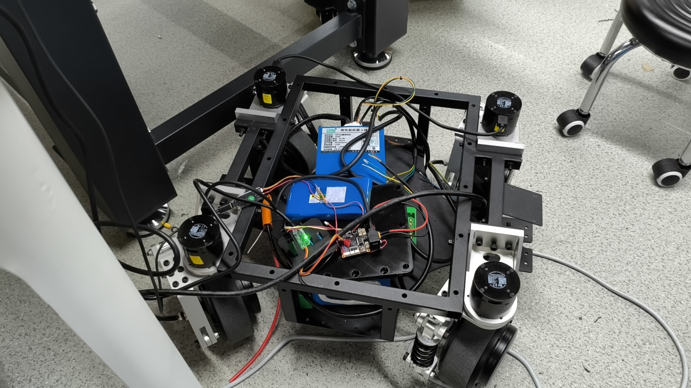
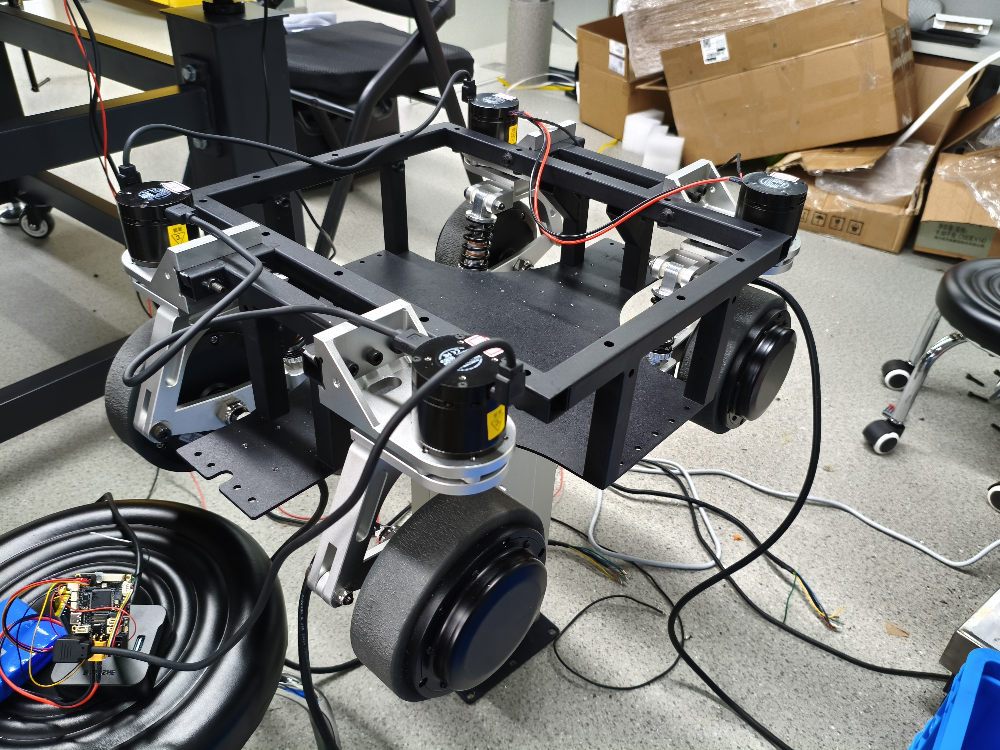

# CtrBoard-H7-AIBOT-DPD 工程说明

> 工程: CtrBoard-H7-AIBOT-DPD
> 主控: STM32H723VGTx, 达妙 DM-MC-Board02
> 当前主链路: SBUS 遥控 -> 四舵轮逆运动学 -> ROBSTRIDE RS00 舵向位置控制 + DS/RS/UM 轮毂速度控制
> 保留链路: LD2-RS/RS485 差速轮毂代码仍在工程内, 但运行期任务当前未启用



## 当前状态

本工程已经从原二轮差速底盘文档口径切换到四舵轮底盘代码工程。当前主循环实际执行四个 ROBSTRIDE RS00 舵向电机的位置控制，并通过 USART2 RS485 执行四个 DS/RS/UM 轮毂电机的速度控制，同时运行 VOFA+ 监测和 LED 状态刷新。

需要特别注意两点:

- `Core/Src/main.c` 中 `app_ld2rs_task_run()` 当前被注释，因此 USART3 上的 LD2-RS 差速轮毂运行时 FSM 不参与主循环。
- `App/Src/app_steer_chassis.c` 已计算四个轮毂的目标速度幅值和反转标志，`app_wheel_task_run()` 会将其转换为有符号 rpm，并通过 USART2 RS485 实际下发。

## FDCAN 配置要点

| 参数 | 值 | 说明 |
|------|-----|------|
| ExtFiltersNbr | 1 | 1 个扩展过滤器 (mask=0 全通) |
| StdFiltersNbr | 0 | 不需要标准 ID 过滤 |
| AutoRetransmission | ENABLE | 仲裁失败硬件自动重传 (多电机同步关键) |
| RxFifo0ElmtsNbr | 16 | 4 电机 @ 20ms 上报绰绰有余 |
| TxFifoQueueElmtsNbr | 8 | 位置指令 + 启动配置足够 |

> `AutoRetransmission=DISABLE` 时, Host 命令 (comm 0x12, bit28=1) 在 CAN 仲裁中输给电机反馈 (comm 0x02, bit28=0), 帧被静默丢弃。多电机场景下 ID=4 (仲裁优先级最低) 受害最重, 表现为运动卡顿不同步。

## TIM6 与舵向 CAN 周期调度

TIM6 作为裸机软件调度时基，不输出 PWM，也不使用 `HAL_Delay()` 或 `HAL_GetTick()` 实现该周期。当前参数为 `Prescaler=239`、`Period=999`，更新中断周期为 1 ms。

```text
TIM6_DAC_IRQHandler()
  -> HAL_TIM_IRQHandler(&htim6)
  -> HAL_TIM_PeriodElapsedCallback()
     -> 1 ms 软件计数器加 1
     -> 累计 20 次后置位 s_steerwheel_chassis_task_20ms_flag
  -> 主循环调用 app_steer_chassis_rc_control()
  -> app_steer_chassis_run() 检测并先清除标志
  -> bsp_can_robostride_send_steer_chassis_position()
     -> 连续向 FDCAN TX FIFO 加入 FL/RL/RR/FR 四帧 loc_ref
```

调度宏位于 `Core/Inc/main.h`：

```c
#define APP_SCHEDULER_TICK_MS        1U
#define APP_STEER_TASK_PERIOD_MS     20U
```

任务标志使用 `extern volatile`，定义在 `Core/Src/tim.c`。它是一次性事件标志，不应被当作持续 20 ms 的电平状态。消费方必须先清标志，再执行 CAN 发送。

轮毂 RS485 非阻塞状态机 `app_wheel_task_run()` 不受 20 ms CAN 标志限制，仍由主循环持续推进。

## 硬件与外设

| 用途 | 外设 | 引脚 | 参数 |
|------|------|------|------|
| ROBSTRIDE RS00 x4 舵向 | FDCAN1 | PD0 RX / PD1 TX | 1 Mbps, Classic CAN 2.0, 29-bit 扩展帧 |
| DS/RS/UM x4 轮毂 | USART2 RS485 | PD5 TX / PD6 RX / PD4 DE | 115200 8N1, Modbus RTU, ID 01/02/03/04 |
| TIM6 调度测量 | GPIO 输出 | PA0 (`TEST_PIN_FOR_SCOPE`) | 推挽、无上下拉、低速、默认低电平 |
| SBUS 遥控 | UART5 | PB13 TX / PD2 RX | 100000 8E2, DMA + IDLE |
| VOFA+ 调试 | USART1 | PA9 TX / PA10 RX | 115200 8N1 |
| LD2-RS 保留链路 | USART3 RS485 | PD8 TX / PD9 RX / PB14 DE | 115200 8N2 |
| WS4810 LED | SPI6 | CubeMX 配置 | SPI 模拟时序 |

## 目录结构

```text
Core/        CubeMX 生成代码和 main.c 入口, 仅 USER CODE 区编辑
App/         应用层: 舵向运动学、轮毂轮询与速度控制、遥控业务、保留的 LD2-RS FSM、LED
BSP/         硬件抽象: FDCAN ROBSTRIDE、USART2/USART3 RS485、SBUS、VOFA、WS4810
Middleware/ 纯协议/算法: RobStride、Modbus RTU、DS/RS/UM、LD2-RS、低通滤波
Drivers/    STM32H7 HAL 和 CMSIS
DSP/         工程本地 CMSIS-DSP 源码
MDK-ARM/     Keil 工程文件
GCC/         GCC 启动文件和链接脚本
```

依赖方向保持为:

```text
Middleware -> no HAL/App dependency
BSP        -> HAL + Middleware
App        -> BSP + Middleware
Core       -> App/BSP entry points
```

## 启动顺序

`main()` 中的主要启动流程:

```text
HAL_Init()
SystemClock_Config()
MX_GPIO/DMA/USART/SPI/FDCAN init
MX_TIM6_Init()
bsp_rs485_init()
ld2_motor_init(M1/M2)
HAL_Delay(APP_SYSTEM_START_DELAY_MS)
app_chassis_ld2rs_motor_ctrl_init(M1/M2)
app_chassis_ld2rs_motor_ctrl_param_read_back(M1/M2)
app_chassis_ld2rs_motor_ctrl_pi_init(M1/M2)
bsp_rc_init()
app_ld2rs_task_init()
app_led_indicator_init()
bsp_can_robostride_init()
bsp_rs485_bus2_init()
ds_rs_um_motor_init(FL/RL/RR/FR, ID 01/02/03/04)
四台轮毂驱动器进入速度模式并使能
app_wheel_task_init()
app_steer_chassis_init()
HAL_TIM_Base_Start_IT(&htim6)
while(1)
```

## PA0 示波器验证

PA0 已由 CubeMX 配置为 `TEST_PIN_FOR_SCOPE` 推挽输出，并在 `MX_GPIO_Init()` 中初始化为低电平。验证每 20 ms 发生一次 CAN 四帧发送时，应在消费任务标志的位置翻转 PA0：

```c
if (s_steerwheel_chassis_task_20ms_flag != 0U) {
    s_steerwheel_chassis_task_20ms_flag = 0U;
    HAL_GPIO_TogglePin(TEST_PIN_FOR_SCOPE_GPIO_Port,
                       TEST_PIN_FOR_SCOPE_Pin);
    bsp_can_robostride_send_steer_chassis_position(
        &s_robstride_steer_chassis);
}
```

示波器应测得相邻跳变间隔约 20 ms；由于每次发送只翻转一次，完整方波周期为 40 ms、频率为 25 Hz，但 CAN 四帧发送事件仍为 50 Hz。不要在主循环中用任务标志直接控制 PA0 高低电平：标志会被 CAN 发送分支立即清除，这只会产生一个很窄的高电平脉冲，不能形成持续 20 ms 的电平。

其中 LD2-RS 初始化仍会配置 M1/M2 的速度模式、零速、速度源、加减速和 PI 参数。进入 `while(1)` 后, 当前代码没有调用 `app_ld2rs_task_run()`。

## 主循环

当前 `while(1)` 实际控制链路:

```text
app_rc_channels_check_lost(&g_rc)
app_steer_chassis_rc_control(&g_rc_filter)
  -> app_steer_chassis_run()
     -> RC 映射到 vx/vy/wz
     -> 四轮逆运动学
     -> 舵角折叠 + 轮毂反转标志
     -> 写入四个 ROBSTRIDE 目标角
     -> bsp_can_robostride_send_steer_chassis_position()
     -> app_wheel_task_run()
        -> 轮毂线速度转换为有符号 rpm
        -> 四轮统一 200 rpm 限幅
        -> USART2 RS485 非阻塞读写 FSM
App_Vofa_UpperDisplay()
app_led_indicator_update()
```

## 四舵轮运动学

车体坐标系为右手系:

```text
x+  前方
y+  左侧
wz+ 逆时针
```

模块顺序和 CAN ID:

| 模块 | 枚举 | CAN ID | x (m) | y (m) |
|------|------|--------|-------|-------|
| FL 左前 | `APP_STEER_MODULE_FL` | 1 | +0.1675 | +0.200425 |
| RL 左后 | `APP_STEER_MODULE_RL` | 2 | -0.1675 | +0.200425 |
| RR 右后 | `APP_STEER_MODULE_RR` | 3 | -0.1675 | -0.200425 |
| FR 右前 | `APP_STEER_MODULE_FR` | 4 | +0.1675 | -0.200425 |

源码公式:

```c
vx_i = vx - wz * y_i;
vy_i = vy + wz * x_i;
raw_angle = atan2f(vy_i, vx_i);
folded_angle = steer_angle_fold(raw_angle, &hub_reverse_flag);
target = folded_angle + steer_zero_offset_rad;
```

摇杆使用 `RC_Filter_t` 中的一阶低通滤波值；VRA、VRB 当前直接读取未经滤波的 `g_rc.vra`、`g_rc.vrb`。两个旋钮的有效范围均为 `[0,1600]`，线性油门比例为：

```text
translation_scale = clamp(VRA / 1600, 0, 1)
rotation_scale    = clamp(VRB / 1600, 0, 1)
```

当前最大速度配置：

| 配置 | 数值 | 控制旋钮 |
|------|------|----------|
| `APP_STEER_CHASSIS_MAX_VX_MPS` | `1.5708 m/s` | VRA |
| `APP_STEER_CHASSIS_MAX_VY_MPS` | `1.5708 m/s` | VRA |
| `APP_STEER_CHASSIS_MAX_WZ_RAD_S` | `2.1654 rad/s` | VRB |

当前遥控映射按源码等价为：

```text
vx = clamp(ch_rx / 800)  * 1.5708 * translation_scale
vy = clamp(-ch_ly / 800) * 1.5708 * translation_scale
wz = clamp(-ch_ry / 800) * 2.1654 * rotation_scale
```

安全停机条件：急停标志、RC 掉线、SWA_DOWN。触发后 `vx=vy=wz=0`，四个轮毂目标速度也随之归零，USART2轮毂FSM继续轮询并下发零速。

## 舵角折叠与轮毂速度

`steer_angle_fold()` 将 `atan2f()` 输出从 `[-pi, +pi]` 折叠到 `[-pi/2, +pi/2]`:

```text
raw > +pi/2  -> raw - pi, hub_reverse_flag = 1
raw < -pi/2  -> raw + pi, hub_reverse_flag = 1
otherwise    -> raw,      hub_reverse_flag = 0
```

这使舵向电机只需转到半圆范围内，轮毂反转标志用于补偿物理运动方向。四轮运动学结果写入：

```text
modules[i].hub_target_speed_mps
modules[i].hub_reverse_flag
```

### 轮毂速度换算与统一限幅

当前轮毂参数：

| 参数 | 数值 |
|------|------|
| 轮毂电机允许转速 | `-200～+200 rpm` |
| 轮毂半径 | `0.075 m` |
| 驱动减速比 | `1:1` |

`app_wheel_task_run()` 将轮毂线速度幅值转换为有符号rpm。运动学反转标志决定轮毂运动方向，`APP_WHEEL_*_POLARITY` 补偿左右轮机械安装方向：

```text
signed_rpm = hub_speed_mps * 60 * drive_gear_ratio / (2*pi*wheel_radius)
             * reverse_sign * mounting_polarity
```

四轮目标转速计算完成后，程序查找最大绝对转速。若超过200 rpm，则四轮使用同一个比例系数缩小：

```text
speed_scale = 200 / max_abs_wheel_rpm
wheel_rpm[i] = wheel_rpm[i] * speed_scale
```

因此最终任意一个轮毂的目标转速绝对值都不超过200 rpm，同时保持四轮速度之间的比例关系。

VRA、VRB均旋到一半，即 `VRA=VRB=800`，相关摇杆满量程时，当前配置的结果约为：

| 满杆组合 | 最快轮转速（最终限幅前） |
|----------|--------------------------|
| 纯 `vx` 或纯 `vy` | `100 rpm` |
| 纯 `wz` | `36 rpm` |
| `vx+vy` | `141 rpm` |
| `vx+wz` | `130 rpm` |
| `vx+vy+wz` | `177 rpm` |

这里 `APP_STEER_CHASSIS_MAX_WZ_RAD_S=2.1654f` 是VRB满量程时的配置值；VRB=800时实际最大 `wz=1.0827 rad/s`。VRA和VRB分别缩放平移、旋转分量，并不是统一控制最终轮速上限的总油门。

### USART2轮毂任务

轮毂Modbus站号与位置：

| ID | 位置 |
|----|------|
| 01 | FL左前 |
| 02 | RL左后 |
| 03 | RR右后 |
| 04 | FR右前 |

`app_wheel_task_run()` 使用非阻塞FSM轮询四台驱动器，每台驱动器执行：

```text
读取 D0.000 实际速度 -> 写入 F0.3.018 目标速度 -> 切换到下一台驱动器
```

## ROBSTRIDE 控制链路

初始化入口:

```text
app_steer_chassis_init()
  -> bsp_can_robostride_init_steer_chassis()
  -> app_steer_chassis_zero_offset_init()
  -> bsp_can_robostride_start_steer_chassis()
```

每个 RS00 上电配置（10 步，通信类型标注于括号）:

```text
① run_mode = 1 (PP)                    [0x12]
② enable motor                         [0x03]
③ EPScan_time = 3 (20ms)              [0x12]
④ enable periodical report             [0x18]
⑤ vel_max = 20.0 rad/s                [0x12]
⑥ acc_set = 100.0 rad/s²              [0x12]
⑦ loc_ref = steer_zero_offset_rad     [0x12]
⑧ spd_kp = 180 / loc_kp = 150         [0x12]
⑨ zero_sta = 1 (-π~π)                [0x12]
⑩ save all params to Flash             [0x16]
```

> type 22 (0x16) 保存全部 RAM 参数到 Flash, 掉电不丢。0x2xxx 调试区参数 (spd_kp/loc_kp) 不在 Flash 保存范围内, 由 MCU 每次上电重新写入。

运行期 `bsp_can_robostride_send_steer_chassis_position()` 遍历四个模块, 对满足 1 ms 间隔的模块发送 `loc_ref` 目标角。当前实现检查每个模块自己的 `robstride_last_tx_tick_ms`; `robstride_next_tx_index` 字段存在但未作为轮转起点使用。

## 反馈解析

FDCAN1 RX FIFO0 中断回调只接收扩展数据帧 DLC=8。有效帧交给 `robstride_motor_parse_rx_frame()`:

- `0x02`: 周期反馈
- `0x18`: 上报反馈

反馈数据解析为原始位置、速度、力矩、温度、故障码和模式状态。BSP 层再写回 `steer_module_t.feedback`, 并计算:

```c
position_new_rad = position_raw_rad - steer_zero_offset_rad;
position_new_deg = position_new_rad * 180 / pi;
```

## VOFA+ 当前通道

`App_Vofa_UpperDisplay()` 当前实际发送 `float vofa_channels[21]`，每20 ms一帧。

当前有效通道：

| CH | 内容 |
|----|------|
| CH01~CH03 | 急停标志、RC掉线标志、SWA状态 |
| CH04~CH07 | FL/RL/RR/FR舵向给定角 (°) |
| CH08~CH11 | FL/RL/RR/FR舵向原始反馈角 (°) |
| CH12~CH15 | FL/RL/RR/FR轮毂反转标志 |
| CH16~CH19 | FL/RL/RR/FR轮毂目标线速度幅值 (m/s) |
| CH20 | `s_steerwheel_chassis_task_20ms_flag` |
| CH21 | `GPIOA_PIN0_FLAG` |

当前VOFA载荷没有发送四轮经过统一限幅后的有符号目标rpm。旧文档中的17/19/23通道表和LD2-RS转速通道不再代表当前主循环实际发送内容。

## 构建

Keil 主工程:

```text
MDK-ARM/CtrBoard-H7-AIBOT-DPD.uvprojx
```

GCC Makefile 验证:

```powershell
make
make V=1
make clean
```

GCC 产物名:

```text
build/CtrBoard-H7-AIBOT-DPD.elf
build/CtrBoard-H7-AIBOT-DPD.map
build/CtrBoard-H7-AIBOT-DPD.hex
build/CtrBoard-H7-AIBOT-DPD.bin
```

Keil 仍是正式调试和烧录入口; GCC Makefile 主要用于命令行编译验证。

## 当前未完成项

- `app_ld2rs_task_run()` 当前未接入主循环。
- VOFA 通道注释仍需随调试需求持续整理。

